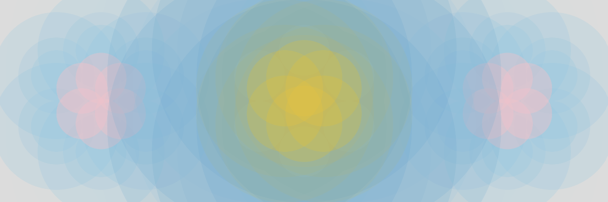

# Assignment Day 1

## Representing Peace Visually

The feeling i got was 'Peace'. The object of the assignment is to visually represent an abstract artwork, made thorugh code.

### My interpretation of 'Peace'

Peace for me meant perfect harmony, synchronization, symmetry; a fleeting moment of clarity and peace.

I wanted to capture that feeling.

I used Circles to form a sacred geometry/flower of life inspired form. The colours-mild, soft and easy on the eyes.  

### Coding Aspects

The composition consists of ellipses in a polar arrangment like flowers. I brute forced the polar/radial arrangement of the ellipses. Functions or classes were not yet taught in class.

