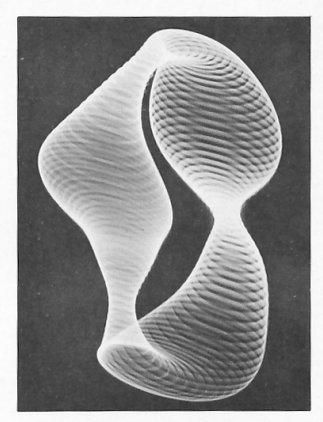

# Assignment Day 3

## Interactive 10print

The assignment is to create a interactable 10Print pattern of our choice using what we learned in Day 1,2 & 3.

### My idea
I had a lot of confusion in this assignment. for() loop conditions were going over my head and i wanted to make a simple project.

My idea was to create a grid of circles whose stroke keeps varying, opacity keeps varying and size changes according to mouse position on the canvas.

Inspiration i had for reference.

Click the Link Below to view the Assignment->

https://aashishishish.github.io/NID_P5JS_AashishAnand/DAY%203/Assignment/Assignment%20V1/

## Learnings and improvements

The final output is not what i had in mind but this was what i could do in the given time. Ill try to make it again which will stay true to the inspiration.

Learned random() and for() loops.

