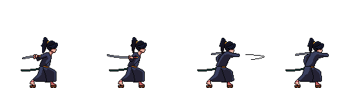
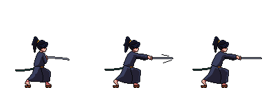
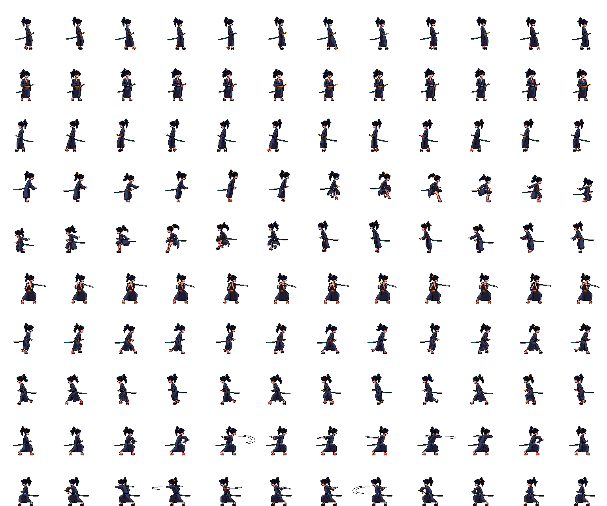
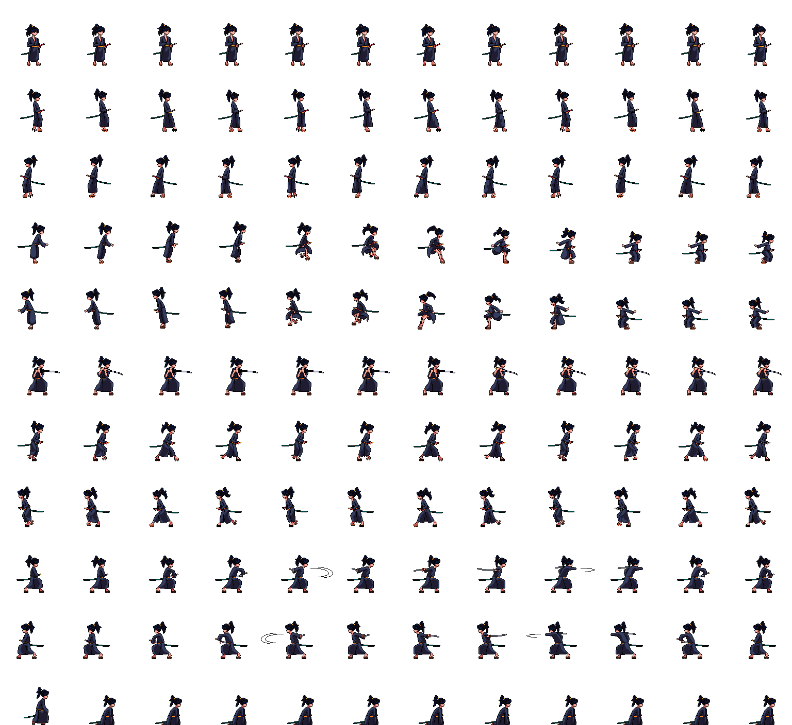

# Assignment Day 5

## Sprite Animation

The Objective of this assignment is to create a 1D sprite animation and a 2D sprite animation with the help of Arrays and for() loops and User inputs.

### 1D Sprite Animation

The Original Sprite sheet is of a Samurai, sourced from [craftpix.net](https://craftpix.net/freebies/free-shinobi-sprites-pixel-art/).

The sprite sheet sourced from this website was a collection of single 1D sprite sheet. So i combined all of them in Photoshop into a single spritesheet to form a 2D Sprite Sheet.

         

The Corrected Sprite Sheet. ->

To make this 1D Sprite animation i just limited the for() loop to read only a single row and play the animation with mouse clicks (mousePressed).

*Click the link below to see the 1D Sprite Animation.->*

https://aashishishish.github.io/NID_P5JS_AashishAnand/DAY%205/Assignment/SpriteAnimation_1D/

### 2D Sprite Animation

Like before Original Sprite sheet is of a Samurai, sourced from [craftpix.net](https://craftpix.net/freebies/free-shinobi-sprites-pixel-art/).

The Corrected Sprite Sheet for 2D Sprite Animation. ->

In this assignment we called a particular row from the sprite sheet for a particular key press which the help of for() loops, keyPressed(), and keyIsDown and if_else Conditions.

*Click the link below to see the 2D Sprite Animation->*

Controls -
Walk right--> Right arrow
Walk Left--> Left arrow
Jump in place--> Up arrow
Jump Right--> Right arrow + Up arrow
Jump Left-->Left arrow + Up arrow
Run Right--> Right arrow+ Right Ctrl
Run Left --> Left arrow + Right Ctrl
Attack Right-->Right arrow + g
Attack Left -->Left arrow + g
Shield --> Down arrow

https://aashishishish.github.io/NID_P5JS_AashishAnand/DAY%205/Assignment/SpriteAnimation_2D/

