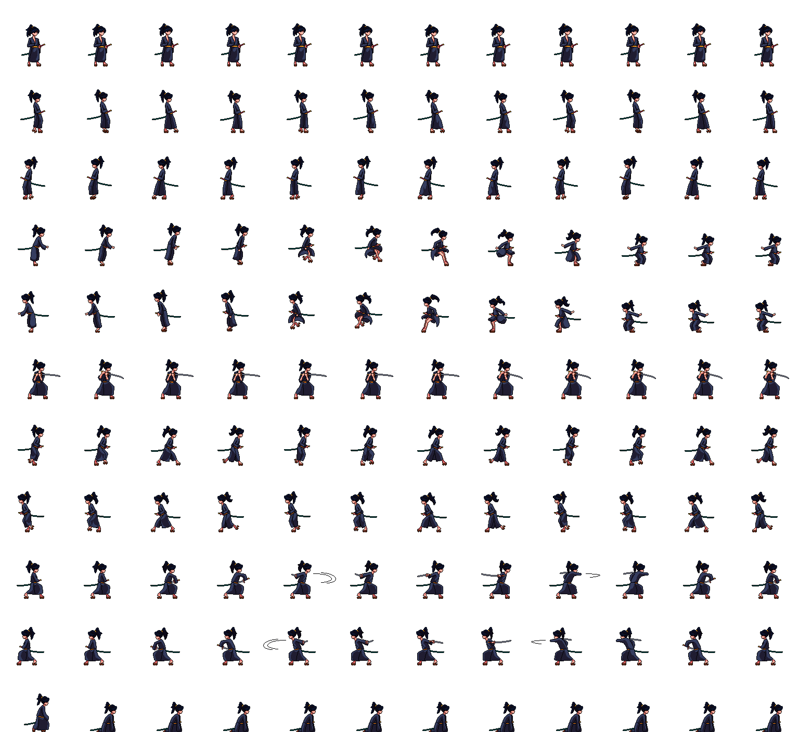

# Week 1 Weekend Assignment

## Samurai and her pet

### Narrative

There lived a young samurai, in a small hut with her pet, a calf.
One day the calf runs away from their home. The samurai has to go find the calf and bring the calf back before it's night.

### Characters

Young Samurai

Calf

### Interactions
I planned on making the characters animated using sprites but they will be mostly stationary in the centre of the screen.
Whenever the user gives inputs for movements, the background will be moved giving the illusion of the character moving forward through the landscpae. The background is a long extended image that moves with user inputs(left and right arrows).

The image in front of the created canvas will be only scene at a time, so the user can get a feeling of exploration and anticipation on whats coming next.
The user will press any key to start, when that happens, the calf runs away to the end of the background.

When the experience starts, the scene will get darker with time, so like its turning to night. The user has to bring back the calf before its totally night. If its totally night, the user can see anything and in the story, they're considered as lost while exploring.

### Challenges faced while coding

Moving the background instead of the character.

Trying both the sprites to work together with and without inputs.

Turning to night.

